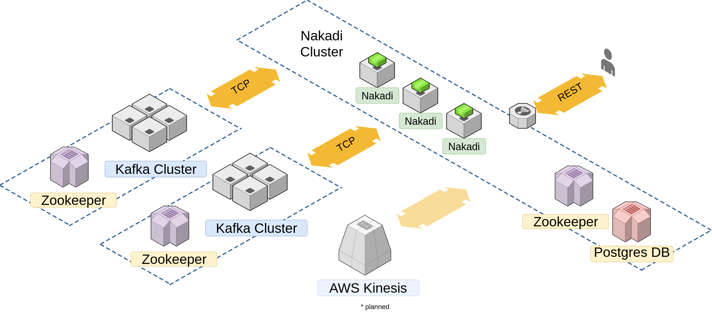

[](https://travis-ci.org/zalando/nakadi)
[](https://codecov.io/github/zalando/nakadi?branch=master)
[](https://www.codacy.com/app/aruha/nakadi?utm_source=www.github.com&amp;utm_medium=referral&amp;utm_content=zalando/nakadi&amp;utm_campaign=Badge_Grade)

## [Nakadi Event Broker](https://zalando.github.io/nakadi/)

Nakadi is a distributed event bus broker that implements a RESTful API abstraction on top of Kafka-like queues.



More detailed information can be found on our [website](http://zalando.github.io/nakadi/).

### Project goal

The goal of Nakadi (**ნაკადი** means *stream* in Georgian) is to provide an event broker infrastructure to:

- Abstract event delivery via a secured [RESTful API](https://zalando.github.io/nakadi/manual.html#nakadi-event-bus-api).
 
    This allows microservices teams to maintain service boundaries, and not directly depend on any specific message broker technology.
    Access can be managed individually for every queue and secured using *OAuth* and custom authorization plugins.

- Enable convenient development of event-driven applications and asynchronous microservices. 

    Event types can be defined with [Event type schemas](https://zalando.github.io/nakadi/manual.html#using_event-types) 
    and managed via a registry. All events will be validated against the schema before publishing. 
    This guarantees data quality and consistency for consumers.    
     
- Efficient low latency event delivery. 
    
    Once a publisher sends an event using a simple [HTTP POST](https://zalando.github.io/nakadi/manual.html#using_producing-events), 
    consumers can be pushed to via a [streaming](https://zalando.github.io/nakadi/manual.html#using_consuming-events-lola)
    HTTP connection, allowing near real-time event processing. 
    The consumer connection has keepalive controls and support for managing stream offsets using
    [subscriptions](https://zalando.github.io/nakadi/manual.html#using_consuming-events-hila). 

### Links

Read more to understand *The big picture* 
[Architecture for data integration](https://pages.github.bus.zalan.do/core-platform/docs/architecture/data_integration.html) 

Watch the talk [Data Integration in the World of Microservices](https://clusterhq.com/2016/05/20/microservices-zalando/) 

### Development status

Nakadi is high-load production ready. 
Zalando uses Nakadi as its central Event Bus Service. 
Nakadi reliably handles the traffic from thousands event types with 
the throughput of more than hundreds gigabytes per second.
The project is in active development. See the [CHANGELOG.md](CHANGELOG.md)   
  
#### Features

* Stream:    
    * REST abstraction over Kafka-like queues.
    * CRUD for event types.
    * Event batch publishing.
    * Low-level interface.
        * manual client side partition management is needed
        * no support of commits
    * High-level interface (Subscription API).
        * automatic redistribution of partitions between consuming clients
        * commits should be issued to move server-side cursors
* Schema:    
    * Schema registry.
    * Several event type categories (Undefined, Business, Data Change).
    * Several partitioning strategies (Random, Hash, User defined).
    * Event enrichment strategies.
    * Schema evolution.
    * Events validation using an event type schema.
* Security:          
    * OAuth2 authentication.
    * Per-event type authorization.
    * Blacklist of users and applications.    
* Operations:    
    * [STUPS](https://stups.io/) platform compatible.    
    * [ZMON](https://zmon.io/) monitoring compatible.
    * SLO monitoring.
    * Timelines. 
        * This allows transparently switch production and consumption to different cluster (tier, region, AZ) without
        moving actual data and any service degradation.
        * Opens possibility for implementation of other streaming technologies and engines besides Kafka 
        (like AWS Kinesis, Google pub/sub etc.)
    
Read more about latest development in our [CHANGELOG.md](CHANGELOG.md) 

#### Additional features that we plan to cover in the future are:

* Support for different streaming technologies and engines. Nakadi currently uses [Apache Kafka](http://kafka.apache.org/) 
    as its broker, but other providers (such as Kinesis) will be possible.     
* Filtering of events for subscribing consumers.
* Store old published events forever using transparent fall back backup shortages like AWS S3. 
* Separate the internal schema register to standalone service.
* Use additional schema formats and protocols like Avro, protobuf and [others](https://en.wikipedia.org/wiki/Comparison_of_data_serialization_formats).

#### Related projects

The [zalando-nakadi](https://github.com/zalando-nakadi/) organisation contains many useful related projects
like

* Client libraries
* SDK
* GUI
* DevOps tools and more

## Quickstart

You can run the project locally using [Docker](https://www.docker.com/). 

### Dependencies

The Nakadi server is a Java 8 [Spring Boot](http://projects.spring.io/spring-boot/) application. 
It uses [Kafka 0.10.2](http://kafka.apache.org/0102/documentation.html) as its broker and
 [PostgreSQL 9.5](http://www.postgresql.org/docs/9.5/static/release-9-5.html) as its supporting database.

Nakadi requires recent versions of docker and docker-compose. In
particular, docker-compose >= v1.7.0 is required. See [Install Docker
Compose](https://docs.docker.com/compose/install/) for information on
installing the most recent docker-compose version.

The project is built with [Gradle](http://gradle.org). 
The `./gradlew` [wrapper script](http://www.gradle.org/docs/current/userguide/gradle_wrapper.html) will bootstrap
the right Gradle version if it's not already installed. 

[Mac OS specific configuration](https://zalando.github.io/nakadi/manual.html#macos)

### Install

To get the source, clone the git repository.
```sh
git clone https://github.com/zalando/nakadi.git
```
### Building

The gradle setup is fairly standard, the main tasks are:

- `./gradlew build`: run a build and test
- `./gradlew clean`: clean down the build

Some other useful tasks are:

- `./gradlew acceptanceTest`: run the ATs
- `./gradlew fullAcceptanceTest`: run the ATs in the context of Docker
- `./gradlew startNakadi`: build Nakadi and start docker-compose services: nakadi, postgresql, zookeeper and kafka
- `./gradlew stopNakadi`: shutdown docker-compose services
- `./gradlew startStorages`: start docker-compose services: postgres, zookeeper and kafka (useful for development purposes)
- `./gradlew stopStorages`: shutdown docker-compose services

For working with an IDE, the `eclipse` IDE task is available and you'll be able to import the `build.gradle` into Intellij IDEA directly.

### Running a Server

From the project's home directory you can start Nakadi via Gradle:

```sh
./gradlew startNakadi
```

This will build the project and run docker compose with 4 services:

- Nakadi (8080)
- PostgreSQL (5432)
- Kafka (9092)
- Zookeeper (2181)

To stop the running Nakadi:

```sh
./gradlew stopNakadi
```

## API Usage Quickstart

Please read the [manual](https://zalando.github.io/nakadi/manual.html) for the full API usage details.

### Creating Event Types

The Nakadi API allows the publishing and consuming of _events_ over HTTP. 
To do this the producer must register an _event type_ with the Nakadi schema 
registry. 


This example shows minimal `undefined` category event type with a wilcard schema -

```sh
curl -v -XPOST http://localhost:8080/event-types -H "Content-type: application/json" -d '{
  "name": "order.ORDER_RECEIVED",
  "owning_application": "order-service",
  "category": "undefined", 
  "schema": {
    "type": "json_schema",
    "schema": "{ \"additionalProperties\": true }"
  }
}'
```
**Note:** This is not recommended category and schema. It should be used only for the testing.

Read mode in the [manual](https://zalando.github.io/nakadi/manual.html#using_event-types) 

### Consuming Events

You can open a stream for an Event Type via the `events` sub-resource:

```sh
curl -v http://localhost:8080/event-types/order.ORDER_RECEIVED/events 
    

HTTP/1.1 200 OK

{"cursor":{"partition":"0","offset":"82376-000087231"},"events":[{"order_number": "ORDER_001"}]}
{"cursor":{"partition":"0","offset":"82376-000087232"}}
{"cursor":{"partition":"0","offset":"82376-000087232"},"events":[{"order_number": "ORDER_002"}]}
{"cursor":{"partition":"0","offset":"82376-000087233"},"events":[{"order_number": "ORDER_003"}]}
```
You will see the events when you publish them from another console for example.
The records without `events` field are `Keep Alive` messages.
 
**Note:** This is the [low-level API](https://zalando.github.io/nakadi/manual.html#using_consuming-events-lola) should be
used only for debugging. It is not recommended for production systems. 
For production systems please use [Subscriptions API](https://zalando.github.io/nakadi/manual.html#using_consuming-events-hila)

### Publishing Events

Events for an event type can be published by posting to its "events" collection:

```sh
curl -v -XPOST http://localhost:8080/event-types/order.ORDER_RECEIVED/events \
 -H "Content-type: application/json" \
 -d '[{
    "order_number": "24873243241",    
  }, {
    "order_number": "24873243242",    
  }]'


HTTP/1.1 200 OK  
```

Read more in the [manual](https://zalando.github.io/nakadi/manual.html#using_producing-events)

## Contributing

Nakadi accepts contributions from the open-source community.

Please read [CONTRIBUTING.md](CONTRIBUTING.md).

Please also note our [CODE_OF_CONDUCT.md](CODE_OF_CONDUCT.md).

## Contact

This [email address](MAINTAINERS) serves as the main contact address for this project.

Bug reports and feature requests are more likely to be addressed
if posted as [issues](https://github.com/zalando/nakadi/issues) here on GitHub.

## License

Please read the full [LICENSE](LICENSE)

The MIT License (MIT) Copyright © 2015 Zalando SE, https://tech.zalando.com

Permission is hereby granted, free of charge, to any person obtaining a copy of this software and associated
documentation files (the “Software”), to deal in the Software without restriction, including without limitation 
the rights to use, copy, modify, merge, publish, distribute, sublicense, and/or sell copies of the Software, and
to permit persons to whom the Software is furnished to do so, subject to the following conditions:

The above copyright notice and this permission notice shall be included in all copies or substantial portions
of the Software.

THE SOFTWARE IS PROVIDED “AS IS”, WITHOUT WARRANTY OF ANY KIND, EXPRESS OR IMPLIED, INCLUDING BUT NOT LIMITED
TO THE WARRANTIES OF MERCHANTABILITY, FITNESS FOR A PARTICULAR PURPOSE AND NONINFRINGEMENT. IN NO EVENT SHALL
THE AUTHORS OR COPYRIGHT HOLDERS BE LIABLE FOR ANY CLAIM, DAMAGES OR OTHER LIABILITY, WHETHER IN AN ACTION OF CONTRACT,
TORT OR OTHERWISE, ARISING FROM, OUT OF OR IN CONNECTION WITH THE SOFTWARE OR THE USE OR OTHER DEALINGS IN THE SOFTWARE.
