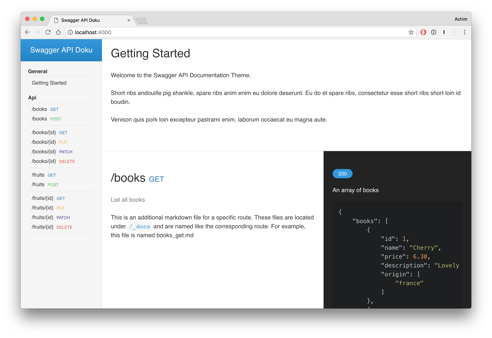

# Swaggyll - A Jekyll Theme For Your Swagger API Documentation

> Swaggyll is a simple 3 column jekyll theme for a documentation of your API with [swagger specifications](http://swagger.io/specification/) and markdown files.



## Setup
1. Clone or download this repo
1. edit url and title in the `_config.yml`
1. add your swagger specification files (yml) to the `_data` folder
1. add your markdown files (filename must be route + method ) which are giving additional informations to a route in the folder `_api`
1. if you want to add some additional infos to your documentation, which doesn't belong to a specific route, add some markdown files to the `_documentation` folder.

## Develop
This theme was build with [Jekyll](http://jekyllrb.com/) version 3.4.0.

To start/build the site on the preview server
```bash
$ bundle exec jekyll serve
```
## Navigation
The sidebar is automatically generated. For every file below `_documentation` there is one navigation link with the title of the file.
Every path in the swagger specification below `_data` is a single navigation link.

## Theming
All colors, sizes, fonts, and even breakpoints are completely customizable via scss. The config is available in `_sass/_config/`
